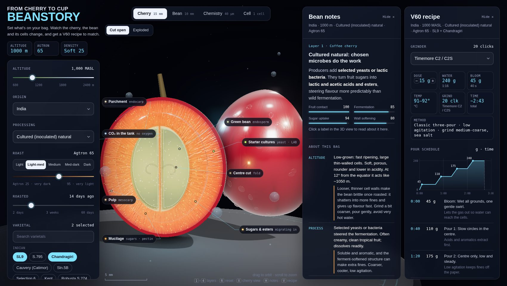
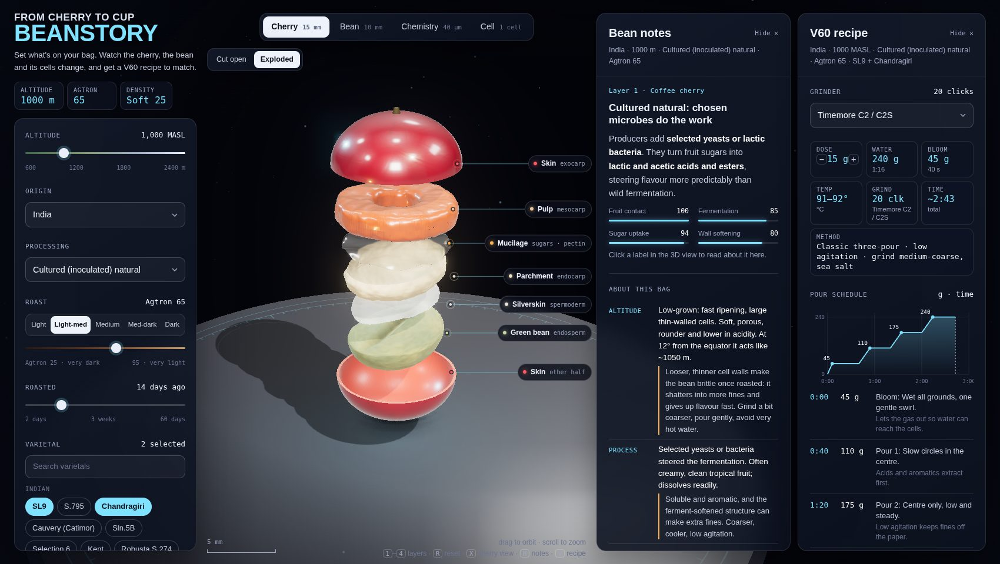
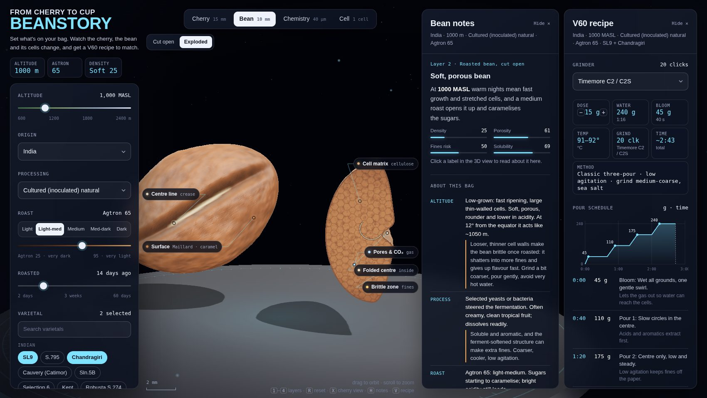
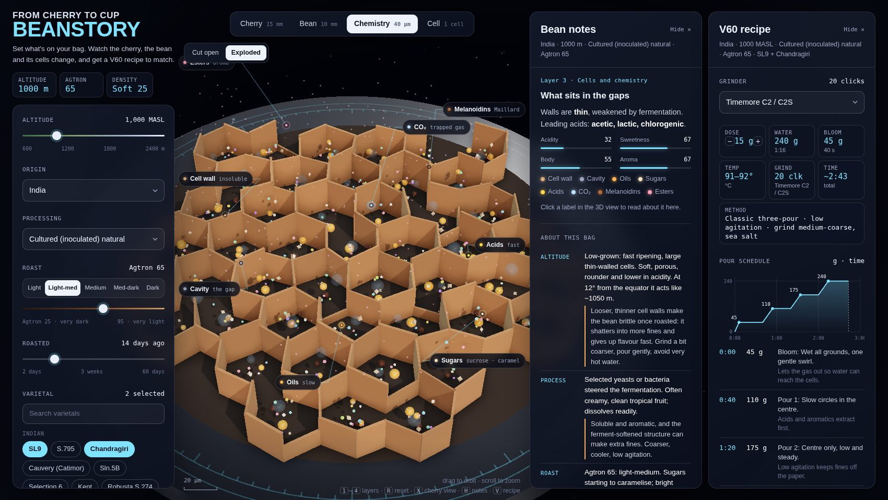
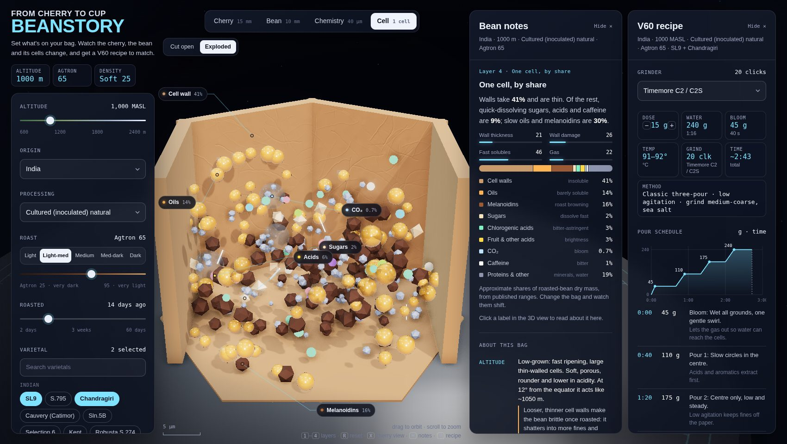
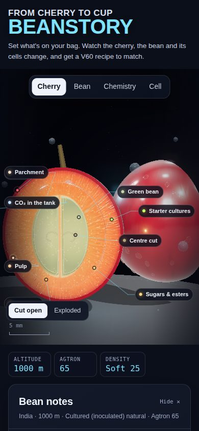

# Beanstory

**From cherry to cup: see what's inside your coffee bean, and how to brew it.**

Beanstory is an interactive 3D explainer for home pour-over brewers. Enter what's printed on your bag (origin, altitude, processing, roast, varietal, roast date) and watch the coffee cherry, the roasted bean and its cells change in front of you. A matching Hario V60 recipe updates alongside.



**Live app:** [Open Beanstory on claude.ai](https://claude.ai/artifact/3969w5PfFhYuEE4vGUDut4), or open `index.html` in any modern browser.

---

## What it does

| Zoom level | What you see | What changes it |
|---|---|---|
| **1 · Cherry** (≈15 mm) | The cherry cut open or exploded into its layers: skin, pulp, mucilage, parchment, silverskin, green bean | Processing (washed strips the fruit, honey leaves mucilage, natural shrivels the cherry, fermentation adds CO₂ tanks, microbes or fruit), varietal (cherry colour, bean size) |
| **2 · Bean** (≈10 mm) | A whole roasted bean beside a cross-section showing the cell net, pores and folded centre cut | Altitude (density, crease shape), roast (colour, expansion, oil, cracks), varietal (shape) |
| **3 · Chemistry** (≈40 µm) | A slab of cells with sugars, acids, oils, CO₂ and melanoidins in the gaps, and aroma rising off the top | Everything: cell size and wall thickness, ruptured walls, acid mix, caramelised sugar, smoke vs. fruity aroma |
| **4 · Cell** (1 cell) | One cell cut open with its contents drawn in proportion, plus a composition bar | The share of walls, oils, melanoidins, sugars, chlorogenic acids, other acids, CO₂, caffeine |

<table>
<tr>
<td></td>
<td></td>
</tr>
<tr>
<td></td>
<td></td>
</tr>
</table>

### Around the 3D view

- **Bag controls:** origin (27 countries), altitude, 14 processing methods (washed, honeys, natural, anaerobic, carbonic maceration, cultured, co-fermented, thermal shock, wet-hulled, Monsooned Malabar, barrel-aged…), roast by name or Agtron number, days since roast, and 31 varietals across Indian, classic and African/exotic groups.
- **Read my bag:** add a photo of the bag (upload, drag in, or paste) and, optionally, a few typed notes, and Claude fills in origin, altitude, process, roast, varietals and roast date. It shows what it found and what it couldn't, with an Undo. Where a Claude view cannot send photos, the photo box gives way to typing the details. The card can be collapsed before or after use. This is optional; every setting can still be set by hand.
- **Bean notes:** the current layer explained, then a plain-language summary of the bag. For altitude, process, roast, varietal and freshness it gives *what it is* and *what it means* (brittleness, fines, solubility), followed by a three-step pouring guide. On claude.ai the summary is written live by Claude, and an **Ask Claude** box answers follow-up questions. Elsewhere, a built-in summary is used.
- **V60 recipe:** temperature, ratio, bloom size and length, number of pours, agitation, pour timeline and total time, all derived from the bag. Grind settings are converted for 9 grinders (Timemore, Comandante, 1Zpresso, Kingrinder, Baratza, Fellow) or given as a target particle size.
- **What changed:** after every tweak a small toast shows which properties moved, for example *Density 23 → 63 · Temp 97–98° · Pours 5*.
- **One-page PDF:** the *PDF ↓* button in the notes panel saves an A4 summary of the current setting: a snapshot of the 3D view, the bean profile, the cell composition, the bean notes and the full V60 recipe.
- **Clickable labels** on every model, plus keyboard shortcuts: `1`–`4` layers, `X` cherry view, `H` notes, `V` recipe, `R` reset view.
- **Works on phones:** the layout stacks on narrow screens.



## Running it

There is nothing to install or build. It's a single HTML file.

```bash
git clone https://github.com/rohitmatlapudi89/beanstory.git
cd beanstory
python3 -m http.server 8000   # or any static file server
# open http://localhost:8000
```

Opening `index.html` directly from disk also works in most browsers. An internet connection is needed for [three.js](https://threejs.org) (r170, loaded from jsDelivr) and Google Fonts.

To host it on **GitHub Pages**, go to *Settings → Pages* and deploy from this branch's root.

### Claude features

The live notes and **Ask Claude** box use the claude.ai artifact *sample* capability. They only run when the page is opened as a Claude artifact, on the viewer's own Claude account, after a one-time permission prompt. Calls use the lightest ("quick") tier, ask for short, structured answers, and are cached for 24 hours per bag. Everywhere else the page falls back to the built-in summary, and everything else works the same.

Visitors who can't get the Claude-written notes (signed out, or viewing outside claude.ai) see a one-time *Sign in with Claude* prompt; after closing it, a small button under the title brings it back.

## How the model works

All the logic lives in `index.html`, in two pure functions:

- `model(state)` turns the bag into relative 0–100 properties (density, porosity, fines risk, solubility, acidity, sweetness, body, CO₂), an acid profile, bean shape and cell parameters, and a composition estimate.
- `recipe(model)` turns those properties into the V60 recipe.

See **[docs/model.md](docs/model.md)** for the rules, the evidence behind them, and what is heuristic.

In short:
- **Roast degree dominates** porosity, brittleness, CO₂ and solubility (well established).
- **Altitude, corrected for latitude,** sets density and acidity (well supported).
- **Processing and varietal** add smaller nudges (generalisations).

## Limitations

- The meters are **relative scores**, not lab measurements. The cell composition is a rough estimate from published ranges for roasted arabica.
- Varietal and processing flavour traits are **tendencies**; terroir, the farm and the roaster often matter more.
- Grinder settings are **starting points**. Two units of the same model can differ by a few steps.
- Water chemistry is not modelled yet.

## Project layout

```
index.html            the whole app: UI, 3D scene (three.js), model and recipe logic
docs/model.md         how the bean model and recipe rules work, with sources
docs/screenshots/     images used in this README
LICENSE               MIT
```

## Credits

- Visual style inspired by Ryan Sael's [The Plane of Focus](https://sael.net/plane-of-focus/).
- Built with [three.js](https://threejs.org), Outfit and DM Mono (Google Fonts).
- Designed and built with [Claude Code](https://claude.ai/code).

## License

[MIT](LICENSE)
